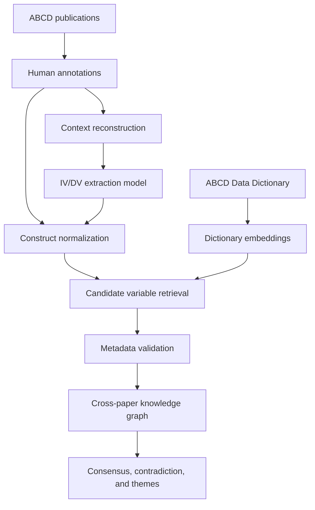
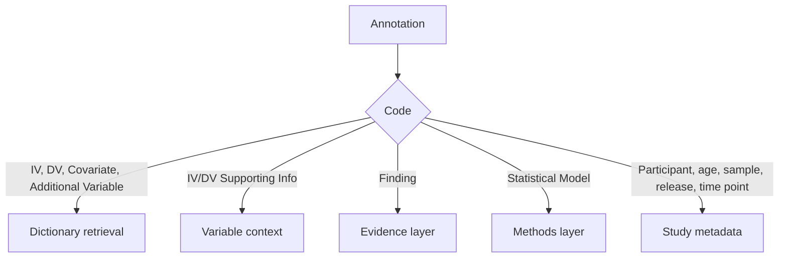
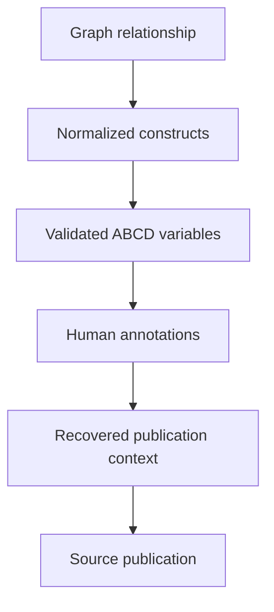

# ABCD Publications Mining

An AI-assisted research pipeline for extracting independent-variable/dependent-variable relationships from Adolescent Brain Cognitive Development (ABCD) Study publications, normalizing research constructs across papers, grounding those constructs in the ABCD Data Dictionary, and building a traceable cross-paper knowledge graph.

## Project Overview

ABCD publications often describe the same scientific construct in different ways. For example, `BMI`, `body mass index`, `child BMI`, and `BMI percentile` may refer to related concepts, but a computer initially treats them as unrelated strings. Even after those names are normalized, the system must still determine which real ABCD variable or variables were used to measure the construct.

This project addresses both problems through two connected tasks:

1. **Automated relation extraction:** identify independent variables (IVs), dependent variables (DVs), and reported findings from ABCD publication text.
2. **Cross-paper synthesis and variable grounding:** normalize differently written constructs, retrieve candidate variables from the ABCD Data Dictionary, validate those candidates, and organize the resulting relationships in a knowledge graph.

The intended final system will allow researchers to examine which constructs were studied together, which ABCD variables may operationalize those constructs, which publications support each relationship, and whether findings across publications show consensus, mixed evidence, or potential contradiction.

## Pipeline



The pipeline follows this order:

```text
extract relationships
→ normalize construct names
→ retrieve ABCD variable candidates
→ validate candidates using metadata and context
→ build the knowledge graph
→ measure cross-paper overlap
→ compare findings
→ identify themes and potential contradictions
```

## Key Definitions

| Term | Definition |
|---|---|
| **Independent variable (IV)** | The exposure, predictor, condition, or explanatory variable whose relationship with another variable is being investigated. |
| **Dependent variable (DV)** | The measured outcome or response that may vary in relation to the IV. |
| **Finding** | The reported direction, significance, magnitude, or interpretation of an IV/DV relationship. |
| **Covariate** | A variable included in an analysis to control for another source of variation. |
| **Construct** | A research concept such as screen time, depression, sleep duration, or body mass index. |
| **Normalization** | Mapping different surface forms, such as `BMI` and `body mass index`, to a shared canonical construct. |
| **Variable grounding** | Connecting a publication-level construct to one or more real variables in the ABCD Data Dictionary. |
| **Embedding** | A numerical vector representing the semantic meaning of text. |
| **Cosine similarity** | A measure of how closely two embedding vectors point in the same direction. |
| **Knowledge graph** | A structured network whose nodes represent constructs and whose edges represent relationships studied in publications. |

## Task 1: IV/DV Relation Extraction

### Objective

Task 1 develops a natural-language processing pipeline that learns from human annotations to identify IVs, DVs, and findings in scientific text.

For example:

```text
Independent variable: sleep duration
Dependent variable: cortical morphology
Finding: shorter sleep duration was associated with differences in cortical morphology
```

### Human-Annotated Data

The current annotation dataset contains **12,439 rows** with four primary fields:

| Field | Description |
|---|---|
| `annotations_id` | Unique annotation identifier |
| `Source` | Publication or PDF associated with the annotation |
| `Content` | Text selected by the human annotator |
| `Codes` | Annotation category assigned to the text |

Major annotation categories include:

| Category | Rows | Pipeline role |
|---|---:|---|
| Findings | 2,268 | Evidence and interpretation |
| Covariate | 1,704 | Candidate research variable |
| Independent Variable | 1,264 | Candidate research variable |
| Dependent Variable | 1,073 | Candidate research variable |
| Statistical Model | 897 | Method information |
| Sample Size | 799 | Study metadata |
| Participant Age | 790 | Study metadata |
| ABCD Time Point | 784 | Study metadata |
| Participant | 704 | Study metadata |
| ABCD Release | 599 | Study metadata |
| Additional Variable | 573 | Candidate research variable |
| IV Supporting Info | 516 | Context for an IV |
| DV Supporting Info | 468 | Context for a DV |

The project preserves all annotation categories. Only variable-like categories are sent to dictionary retrieval; findings, supporting information, methods, and study metadata are retained for their appropriate downstream roles.

### Annotation Routing



### Annotation-Guided Context Reconstruction

Human annotations are often short excerpts, while the extraction model must eventually operate on full publication text. `match_pdfs_to_annotations.py` reconstructs the surrounding context by:

1. locating the source PDF using the annotation’s `Source` value;
2. extracting text with `pdfplumber`;
3. normalizing Unicode, quotation marks, capitalization, hyphenation, and whitespace;
4. searching for the full annotated excerpt;
5. progressively trying shorter prefixes when an exact match is unavailable;
6. extracting 500 characters before and after the match; and
7. falling back to the original annotation when a reliable PDF match cannot be recovered.

Approximately **96% of examined annotations** were connected to publication context. Because the labels remain human-generated, this process is best described as **annotation-guided context reconstruction inspired by weak and distant supervision**.

### Supervised Training Data

The reconstructed contexts are converted into JSON Lines instruction–response examples. The current training set contains approximately **647 context-to-label pairs**.

Conceptual positive example:

```json
{
  "prompt": "Extract the IV, DV, and finding from the following research context: ...",
  "completion": {
    "independent_variable": "sleep duration",
    "dependent_variable": "cortical thickness",
    "finding": "Shorter sleep duration was associated with lower cortical thickness."
  }
}
```

Conceptual negative example:

```json
{
  "prompt": "Extract the IV, DV, and finding from the following research context: ...",
  "completion": "No relationship found."
}
```

### LoRA/QLoRA-Style Adaptation

The project uses parameter-efficient fine-tuning rather than updating every parameter of a seven-billion-parameter model. LoRA freezes the pretrained weights and introduces smaller trainable low-rank matrices into selected Transformer layers. When a compatible NVIDIA GPU is available, the base model can be loaded using four-bit NF4 quantization, producing a QLoRA-style training pathway.

Current LoRA settings include:

| Parameter | Value |
|---|---:|
| Rank (`r`) | 8 |
| Scaling (`alpha`) | 16 |
| Dropout | 0.05 |
| Target modules | Query, key, value, and output projections |

The final adapter is stored separately from the base model, allowing collaborators to reuse the trained behavior without storing a second complete copy of the base model.

### Preliminary Finding

The adapted model produced plausible extractions for many positive examples but frequently generated relationships for passages in which no relationship was supported. The most likely cause is severe class imbalance: the training data contain hundreds of positive demonstrations but almost no explicit negative examples.

The next Task 1 improvement is therefore to add diverse, manually verified negative examples and separately evaluate:

- **relation detection:** whether a valid relationship exists; and
- **relation extraction:** whether the extracted IV, DV, and finding match the human annotation.

Evaluation must split data at the publication level to prevent highly similar excerpts from the same paper from appearing in both training and testing data.

## Task 2: Construct Normalization and Variable Grounding

### Objective

Task 2 creates a cross-paper synthesis system that can:

- normalize different names for related constructs;
- connect publication constructs to real ABCD variables;
- identify construct pairs studied across multiple publications;
- preserve the direction of IV-to-DV relationships;
- compare findings across papers; and
- organize constructs into broader thematic communities.

### Construct Normalization

Without normalization, equivalent phrases become separate graph nodes:

```text
BMI
body mass index
child BMI
BMI percentile
```

The normalization stage maps surface forms to canonical labels, for example:

```text
BMI → body mass index
body mass index → body mass index
screen media use → screen time
time spent using electronic devices → screen time
```

Normalization solves the duplicate-identity problem, but a canonical name alone does not reveal the exact ABCD variable used to operationalize the construct. The project therefore adds dictionary grounding after normalization.

### ABCD Data Dictionary Analysis

The analyzed workbook contains **93,699 variables and 43 metadata columns**. The embedding pipeline excludes **3,546 administrative variables**, leaving **90,153 non-administrative research variables** in the semantic search index.

Important dictionary fields include:

| Field | Description |
|---|---|
| `name` | Machine-readable ABCD variable identifier |
| `label` | Human-readable variable description |
| `domain` | Broad scientific area |
| `sub_domain` | More specific scientific area |
| `source` | Respondent or measurement source |
| `table_name` | Machine-readable assessment table |
| `table_label` | Human-readable assessment name |
| `metric` | Measurement or task |
| `atlas` | Brain atlas when applicable |
| `unit` | Measurement unit |
| `type_var` | Item, summary score, or other variable role |
| `type_data` | Stored data type |
| `type_level` | Measurement level such as nominal or ordinal |

Administrative variables remain in the original workbook but are excluded from the default search index because they generally describe visits, records, or data-management operations rather than scientific constructs.

### Contextual Embedding Text

Embedding only the `label` field can be ambiguous. A description such as `Total score` does not identify the assessment, respondent, domain, metric, or unit. The embedding builder therefore converts selected metadata into a readable description.

Example:

```text
Variable: Average beta weight for Monetary Incentive Delay task
(Contrast - loss positive vs. negative feedback; All runs) in Desikan ROI:
Superior parietal (Left hemisphere).
Assessment: Task fMRI - MID - loss positive vs. negative feedback -
all runs (Desikan) [Youth].
Domain: Imaging.
Subdomain: Task fMRI.
Source: Youth.
Metric: Monetary Incentive Delay.
Atlas: Desikan.
Unit: percent signal change (psc).
Variable type: summary score.
```

The default embedding text uses relevant values from:

```text
label, table_label, domain, sub_domain, source,
metric, atlas, unit, and type_var
```

The machine-readable `name` is preserved in metadata for traceability but is not the main natural-language description sent to the embedding model.

### Dictionary Embeddings

The embedding model converts each contextual description into a vector containing **1,536 floating-point values**. The completed dictionary matrix has shape:

```text
(90,153, 1,536)
```

The dimensions are learned numerical features rather than individually named concepts. Texts with similar meanings should produce vectors pointing in similar directions.

The completed embedding index uses:

| Property | Value |
|---|---|
| Model | `text-embedding-3-small` |
| Embedded variables | 90,153 |
| Vector dimensions | 1,536 |
| Vector format | NumPy `.npy` |
| Metadata format | CSV |
| Local storage method | NumPy memory map |

### Embedding Safeguards

Generating the full index requires many API requests, so the builder includes:

- configurable batching;
- retry handling with increasing wait times;
- filtering of blank embedding text;
- memory-mapped vector storage;
- progress checkpoints after completed batches;
- atomic progress-file replacement;
- dataset hashing;
- configuration validation before resuming;
- completed-output detection; and
- vector/metadata row-count checks.

The progress file records the model, number of rows, embedding dimension, selected text columns, filtering setting, dataset hash, and number of completed rows. If the process is interrupted, rerunning the same command continues from the first unfinished row instead of paying to embed completed rows again.

The vector and metadata files are positionally aligned:

```text
vectors[0] ↔ metadata row 0
vectors[1] ↔ metadata row 1
vectors[2] ↔ metadata row 2
```

This alignment is essential because an embedding vector alone does not contain the original ABCD variable name or label.

### Semantic Retrieval

A publication phrase is embedded using the same model and compared with every dictionary vector using cosine similarity:

```text
                   dictionary vector · query vector
similarity = ------------------------------------------------
             dictionary vector length × query vector length
```

Cosine similarity compares vector direction rather than raw magnitude, making it useful for semantic search.

Example query:

```text
parent medication use in the past 24 hours
```

Top test result:

```text
Name: ph_p_meds__rx__24hr_estuse__007
Label: Prescription - Medication 7 (Past 24 hours):
       Estimated use category [Parent]
Domain: Physical Health
Similarity: approximately 0.648
```

Example query:

```text
child drove after using cocaine
```

Top test result:

```text
Name: su_p_ksads__dud__past_003__v01___4
Label: Was there ever a time that your child often drove after using
       the following drugs [Multi-select]: Cocaine (coke, crack) [Version 1]
Domain: Substance Use
Similarity: approximately 0.637
```

These tests show that semantic retrieval can find relevant dictionary variables even when the query does not exactly reproduce the dictionary wording.

### Why Embeddings Do Not Replace Validation Rules

Embedding similarity produces candidates, not confirmed scientific matches. A candidate may describe a related concept but still use the wrong:

- respondent;
- assessment;
- time point;
- metric;
- hemisphere;
- brain atlas;
- measurement unit;
- variable type; or
- summary statistic.

The intended decision process is:

```text
semantic candidate retrieval
→ metadata validation
→ supporting-context review
→ confidence decision
→ accepted mapping or unresolved result
```

This combines the semantic flexibility of embeddings with the scientific precision of metadata and explicit validation rules.

### Batch Candidate Retrieval

The single-query search script confirms that the index works. The batch retrieval stage applies the same method to all variable-like annotation categories:

```text
Independent Variable
Dependent Variable
Covariate
Additional Variable
```

These categories contain approximately **4,614 annotation rows**. Each query will retain its annotation ID, publication source, original content, code, ranked dictionary candidates, similarity scores, and validation metadata.

The system returns multiple candidates instead of forcing one answer so that uncertain mappings can be reviewed or rejected.

## Knowledge Graph Design

After constructs have been normalized and grounded, the project can build a cross-paper knowledge graph.

| Graph component | Meaning |
|---|---|
| Node | Normalized construct |
| Edge | Two constructs studied together |
| Edge weight | Number of distinct publications studying the pair |
| Evidence | Publication IDs and original finding text |
| Grounding link | Candidate or validated ABCD dictionary variable |

The construct graph can initially be undirected for measuring cross-paper overlap:

```text
screen time ↔ depression
```

The evidence layer separately preserves relationship direction:

```text
screen time → depression
```

This distinction is necessary because `screen time → depression` does not necessarily test the same hypothesis as `depression → screen time`.

Relationships reported across multiple publications may later be classified as:

- consensus positive;
- consensus negative;
- consensus null;
- mixed evidence;
- potential contradiction; or
- unclear.

The term **potential contradiction** is used because apparently conflicting findings may result from different samples, covariates, time points, measurements, or statistical models.

## Current Results

| Component | Result |
|---|---|
| Working publication corpus | Approximately 1,795 papers |
| Human annotations | 12,439 rows |
| Context-to-label training examples | Approximately 647 |
| Annotation-to-publication context recovery | Approximately 96% |
| Dictionary variables analyzed | 93,699 |
| Administrative variables excluded | 3,546 |
| Non-administrative variables embedded | 90,153 |
| Embedding dimension | 1,536 |
| Final embedding matrix | `(90153, 1536)` |
| Semantic search | Successfully tested on sample queries |
| Interruption recovery | Successfully tested using checkpoint resume |
| Current development focus | Batch retrieval and candidate validation |

## Repository Map

```text
abcd-pubs-mining/
├── README.md
├── requirements.txt
├── .gitignore
│
├── scripts/
│   ├── extraction/
│   │   └── match_pdfs_to_annotations.py
│   ├── training/
│   │   ├── format_training_data.py
│   │   ├── finetune_braingpt.py
│   │   └── test_finetuned_model.py
│   ├── normalization/
│   │   ├── normalize_iv_dv_labels.py
│   │   ├── build_embed_text.py
│   │   ├── search_embedding.py
│   │   └── batch_search_annotations.py
│   └── utils/
│       └── parser.py
│
├── data/
│   ├── raw/
│   │   ├── annotations-v2.csv
│   │   └── data_dictionary_levels.xlsx
│   ├── interim/
│   │   └── parsed_output.json
│   ├── processed/
│   │   ├── training/
│   │   │   ├── training_pairs_real_context.jsonl
│   │   │   ├── training_pairs_test.jsonl
│   │   │   └── training_examples.json
│   │   └── synthetic/
│   │       ├── synthetic_annotations.json
│   │       └── synthetic_annotations_large.json
│   └── embeddings/
│       ├── dict_embeddings.npy
│       └── dict_embeddings_meta.csv
│
└── models/
    ├── adapters/
    │   └── braingpt-mistral-lora/
    │       ├── adapter_config.json
    │       ├── adapter_model.safetensors
    │       ├── tokenizer_config.json
    │       ├── tokenizer.json
    │       └── README.md
    └── checkpoints/
        └── intermediate training checkpoints
```

### Folder Responsibilities

- `scripts/extraction/`: connects annotations to publication PDFs and reconstructs textual context.
- `scripts/training/`: formats supervised data, fine-tunes the language model, and evaluates the saved adapter.
- `scripts/normalization/`: normalizes constructs, builds the dictionary index, searches embeddings, and retrieves candidates in batches.
- `scripts/utils/`: shared parsing and helper code.
- `data/raw/`: original input datasets that should not be modified directly.
- `data/interim/`: temporary transformed data used during processing.
- `data/processed/`: cleaned, synthetic, and model-ready datasets.
- `data/embeddings/`: generated dictionary vectors and aligned metadata.
- `models/adapters/`: final lightweight inference adapters.
- `models/checkpoints/`: intermediate training state used only for resuming training.

## Installation

Create and activate a Python environment:

```bash
conda create -n abcd-mining python=3.11
conda activate abcd-mining
pip install -r requirements.txt
```

The project uses packages including `pandas`, `numpy`, `openpyxl`, `openai`, `pdfplumber`, `torch`, `transformers`, `datasets`, `peft`, and `networkx`.

## Environment Variables

Set the OpenAI API key before building or searching embeddings:

```bash
export OPENAI_API_KEY="your-api-key"
```

Verify that the variable exists without printing the key:

```bash
python -c "import os; print(bool(os.environ.get('OPENAI_API_KEY')))"
```

API keys must never be committed to the repository.

## Build Dictionary Embeddings

Run a small test first:

```bash
python scripts/normalization/build_embed_text.py \
  --input data/raw/data_dictionary_levels.xlsx \
  --output data/embeddings/test_embeddings \
  --limit 20 \
  --exclude-administrative
```

Build the complete non-administrative index after the test succeeds:

```bash
python scripts/normalization/build_embed_text.py \
  --input data/raw/data_dictionary_levels.xlsx \
  --output data/embeddings/dict_embeddings \
  --exclude-administrative
```

If a run is interrupted, rerun the identical command. The checkpoint safeguards will validate the configuration and continue from the last completed batch.

## Search the Dictionary

```bash
python scripts/normalization/search_embedding.py \
  --query "parent medication use in the past 24 hours" \
  --top-k 5
```

Search results are candidate mappings and should be validated before being attached to the knowledge graph.

## Inspect or Batch-Process Annotations

Start with a limited run:

```bash
python scripts/normalization/batch_search_annotations.py \
  --annotations data/raw/annotations-v2.csv \
  --limit 10
```

The batch pipeline should preserve all annotation rows while sending only variable-like categories to dictionary retrieval.

## Large Generated Files

The completed embedding artifacts are approximately:

```text
dict_embeddings.npy       528 MB
dict_embeddings_meta.csv   60 MB
```

They are generated artifacts and exceed or approach GitHub’s normal file-size limits. They should be stored outside ordinary Git history and shared together through approved external storage.

Recommended `.gitignore` entries:

```gitignore
# Generated embedding index
data/embeddings/

# Intermediate model checkpoints
models/checkpoints/
**/checkpoint-*/

# Secrets and local environment
.env

# Python and operating-system files
__pycache__/
*.pyc
.DS_Store
**/.DS_Store
```

The vector and metadata files must always remain together because their rows correspond by position.

## Evaluation Plan

Dictionary retrieval should be evaluated using a manually reviewed set containing exact matches, paraphrases, ambiguous constructs, imaging variables, behavioral variables, different respondents, and examples with no appropriate dictionary match.

Planned retrieval metrics include:

- **Top-1 accuracy:** whether the first result is correct;
- **Recall@5:** whether a correct variable appears in the first five results;
- **Recall@10:** whether a correct variable appears in the first ten results;
- **Mean reciprocal rank:** how highly the first correct variable is ranked; and
- **abstention accuracy:** whether the system avoids forcing a match when no valid variable exists.

Task 1 evaluation will separately measure relation detection and relation extraction using publication-level train/test separation and precision, recall, and F1 score.

## Limitations

1. The extraction training data contain too few negative examples.
2. Semantic similarity does not prove scientific equivalence.
3. One publication construct may correspond to several ABCD variables.
4. Some constructs may have no direct dictionary variable.
5. Respondent, assessment, time point, metric, atlas, hemisphere, unit, and variable type must be validated.
6. Dictionary retrieval has been tested qualitatively but still requires formal evaluation.
7. Construct normalization requires manual quality review.
8. Graph quality depends directly on normalization and grounding quality.
9. Apparent contradictions may reflect methodological differences rather than genuinely opposing evidence.
10. Large generated artifacts require storage outside ordinary Git tracking.

## Next Steps

1. Complete batch candidate retrieval for IV, DV, covariate, and additional-variable annotations.
2. Preserve ranked candidates and metadata for every annotation.
3. Build and manually review a retrieval evaluation set.
4. Measure Recall@K, top-one accuracy, reciprocal rank, and abstention behavior.
5. Add metadata-aware filtering or reranking.
6. Connect validated ABCD variables to canonical constructs.
7. Add balanced negative examples to the extraction dataset.
8. Evaluate extraction on publications that were not used for training.
9. Build the complete construct graph using distinct publication counts.
10. Compare findings for repeated directed IV-to-DV relationships.
11. Flag consensus, mixed evidence, and potential contradiction.
12. Evaluate thematic graph communities and build an interactive visualization.

## Traceability Goal

Every final graph relationship should be traceable through the complete evidence chain:



The final system should allow a researcher to inspect the original terminology, normalized constructs, candidate dictionary variables, validation status, supporting papers, original findings, and evidence behind any graph-level conclusion.

## Key Methodological Principle

Normalization and grounding are not minor data-cleaning steps. They determine whether meaningful cross-paper synthesis is possible.

- Without normalization, equivalent constructs appear as different graph nodes.
- Without grounding, normalized constructs remain disconnected from actual ABCD measurements.
- Without metadata validation, semantically similar but scientifically different variables may be merged.
- Without traceability, cross-paper conclusions cannot be verified against their source evidence.

## References

- Dettmers, T., Pagnoni, A., Holtzman, A., & Zettlemoyer, L. (2023). *QLoRA: Efficient Finetuning of Quantized LLMs*. arXiv:2305.14314.
- Hu, E. J., Shen, Y., Wallis, P., et al. (2021). *LoRA: Low-Rank Adaptation of Large Language Models*. arXiv:2106.09685.
- Jiang, A. Q., Sablayrolles, A., Mensch, A., et al. (2023). *Mistral 7B*. arXiv:2310.06825.
- Luo, X., Rechardt, A., Sun, G., et al. (2025). *Large language models surpass human experts in predicting neuroscience results*. Nature Human Behaviour.
- Mintz, M., Bills, S., Snow, R., & Jurafsky, D. (2009). *Distant supervision for relation extraction without labeled data*. ACL-IJCNLP.
- [ABCD Study](https://abcdstudy.org/)
- [OpenAI Embeddings Guide](https://platform.openai.com/docs/guides/embeddings)

## Project Status

The full semantic index has been generated for **90,153 non-administrative ABCD variables**. Single-query semantic retrieval and interruption recovery have been tested successfully. Current development is focused on batch retrieval, scientific validation, and integrating validated variable mappings into the cross-paper knowledge graph.
